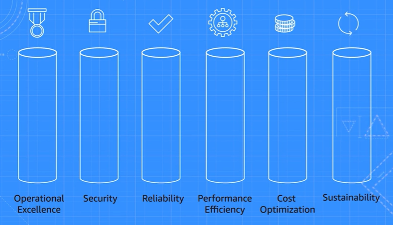
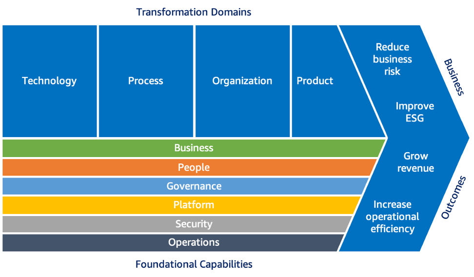
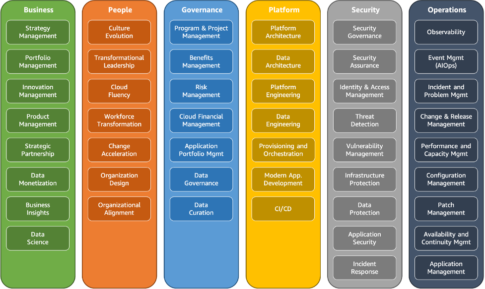
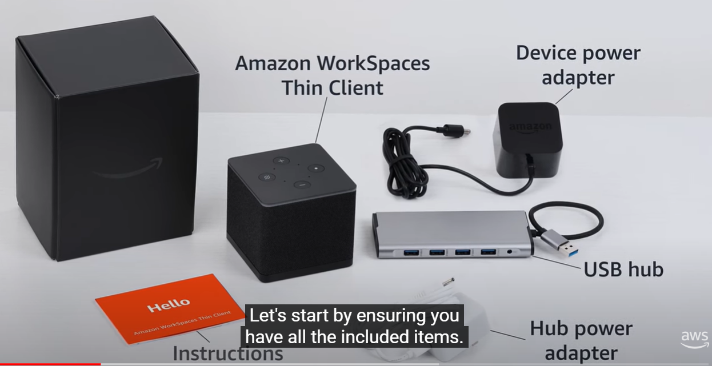

# Chapter 1 - Intro to AWS

## Benefits of AWS

Six main benefits:
* Trade fixed expense for variable expense. So, you can start small rather than making huge upfront hardware purchases
* Benefit from massive economies of scale. So, you pay less due to AWS' bargaining power with hardware manufacturers, software developers, datacentre operators and so on
* Stop guessing capacity. Start small and add or remove capacity quickly or even automatically. This saves you money
* Increase speed and agility. Spin up test environments or applications for experimental new business ventures quickly, and delete the test environments or applications easily
* Stop running datacentres yourself
* Go global in minutes. E.g., to expand an Aussie business to Germany, you don't need to recruit an IT team in Germany and rent a German datacentre. You just make a few API callsZA

## Well-Architected Framework

Well-Architected Framework consists of six pillars (OESRPECOS):
* Operational excellence: Running and monitoring to deliver business values, and continually improving the supporting processes and procedures, e.g., through IaC, frequent small changes, automation and automated monitoring
* Security
* Reliability: Make sure your business applications keep running or at least recover quickly if some of the components that they run on fail; and scaling up to meet unexpected or large demands
* Performance efficiency: Reduce unused compute, storage and network capacity; quickly change the capacity to meet business demand and to keep up with technological changes
* Cost optimisation
* Sustainability: Minimising energy consumption

AWS provides the AWS Well-Architected Tool to assess your AWS account against the six pillars and provide recommendations.

There is *no charge* for the AWS Well-Architected Tool.

## Interesting AWS services
Directory Service:
* Enables AWS resources to integrate with identity providers like Amazon Cognito and Microsoft AD domains

Simple Workflow (SWF):
* Coordinate a series of tasks involving a range of AWS services or even human events. It provides a programming model and infrastructure that make it easier for you to develop aynchronous and distributed applications.

API Gateway:
* Lets you create, publish, maintain, monitor and secure RESTful APIs and WebSocket APIs. Handles traffic management, authorisation, access control, throttling, monitoring and API version management
    * [Amazon API Gateway Overview](https://aws.amazon.com/api-gateway/)
    * [Amazon API Gateway Resources](https://aws.amazon.com/api-gateway/resources/)

## Tools for managing your AWS services

AWS Organizations: See chapter 12.

AWS Control Tower:
* Automatically create and configure new accounts to comply with your security requirements. For example, configure AWS Firewall manager and automate service limit increases
* Extends the capabilities of AWS Organizations
* Orchestrates several other AWS services, including AWS Organizations, AWS Service Catalogue and AWS IAM Identity Center to create a *landing zone* in less than an hour.
* New accounts are provisioned by means of configurable *account templates* in Account Factory
* Uses AWS CloudFormation stacksets to apply controls on accounts
* Prohibit creation and storage of data in certain regions
* Centrally monitor that accounts comply with company policies

[AWS Service Catalog](https://aws.amazon.com/servicecatalog/features/):
* Restrict which IT services your users can use, where the IT services could be AWS services, AMIs, software, DBs and even entire multi-tier app architectures
* Restrict which options can be configured for those IT services
* Restrict which details can be viewed for those IT services
* Involves CloudFormation or Terraform

[AWS License Manager](https://aws.amazon.com/license-manager/features/):
* Centrally manage licenses from Microsoft, SAP, Oracle, IBM and other vendors across AWS and on-premises environments.
* Automatically assign licenses when launching EC2 instances and release licenses when destroying EC2 instances
* Notify administrators of license non-compliance by using Amazon SNS

AWS Artifact:
* Download compliance-related reports about AWS services, e.g., PCI DSS reports, ISO 27001 certifications
* Accept agreements for multiple accounts in your organisation

## Migrating workloads to AWS

### AWS Cloud Adoption Framework

As shown in the cloud transformation value chain below, the benefits that your organisation can get from using the AWS Cloud Adoption Framework are:
* Reduce business risk
* Improve environmental, social and governance (ESG) performance
* Grow revenue
* Increase operational efficiency

The AWS CAF has advice that is organised into six areas, called *Perspectives* (BPGPSO):
* Business: Ensures that IT aligns with business needs, i.e., there is a strong business case for migrating to the cloud. Also makes the business model incorporate IT strategy
* People: Makes HR hire or retrain staff, and potentially restructuring the organisation
* Governance: Ensures that you maximise business value and minimise risks by updating staff skills and updating business processes
* Platform: Fit AWS into your organisation's IT architecture
* Security: Implements security controls
* Operations

Perspectives consist of Foundational Capabilities, as shown below:

Where the Business, People and Governance Perspectives focus on business capabilities, while the Platform, Security and Operations Perspectivies focus on technical capabilities. By considering each Perspective in turn, you identify gaps in your skills and processes. These gaps are called *inputs*. From the inputs, you create an AWS Clouad Adoption Framework *action plan*.

### Six R's of migration

* Rehost: Lift and shift
* Replatform: Link, tinker and shift. i.e., make some cloud optimisations but don't change any core code. E.g., migrate on-prem MySQL to RDS
* Retire
* Retain: Keep on-prem
* Repurchase: Go from on-prem to SaaS, e.g., something from AWS Marketplace. e.g., Go from on-prem CRM to Salesforce.com
* Refactor/re-architect: Write new code that uses cloud-native features. Dramatic change to your architecture.

### Migration services

[AWS Migration Hub](https://aws.amazon.com/migration-hub/features/):
* A single place to access all the tools and documentation that will help in migration to AWS.
* Import info about on-prem servers and applications
* Build a migration plan
* Get recommendations from AWS about migration strategy and app refactoring

[AWS Application Migration Service](https://aws.amazon.com/application-migration-service/resources/):
* Automate many parts of lifting-and-shifting bare-metal servers, VMs and cloud servers to AWS.

[AWS Database Migration Service](https://aws.amazon.com/dms/features/)
* Web service to migrate data from a DB that's on-prem, on an RDS DB instance or in a DB on an EC2 instance
* Minimises downtime because all changes to the source DB that occur during migration are continuously replicated to the target DB.

[AWS Application Discovery Service](https://aws.amazon.com/application-discovery/features/):
* Discover on-prem servers and DBs, collecting details like hostnames, IP addresses, CPU/network/memory/disk usage and DB engine identity/version/edition.
* Identify dependencies between servers by recording inbound and outbound network activity.
* Measure on-prem server performance (CPU, mem, disk, network) so you can establish a performance baseline to use as a comparison after you migrate to AWS.

## AWS SLAs

Published [here](https://aws.amazon.com/legal/service-level-agreements/).

If AWS doesn't meet its SLA, it will give you some credit for a certain percentage of the direct costs that you incur whenever uptime falls below a defined threshold. For example, for EC2, the SLA agreement is [here](https://aws.amazon.com/compute/sla/?did=sla_card&trk=sla_card).

## AWS support plans

Basic support is offered to all customers. It includes support for account and billing questions and service quota increases; pay-by-the-month technical support cases; forums; AWS Trusted Advisor's basic checks; and AWS Personal Health Dashboard

Premium support plans are:
* Developer support: Basic support, plus unlimited technical support cases; direct email access to customer support with 24 hour response time or 12 hours if your system is impaired; and building-block architecture support to advise you on combining AWS services together
* Business support: Developer support, plus AWS Trusted Advisor's full set of checks; direct phone access to cloud support engineers with 4 hour response time if your production system is impaired and 1 hour response time if your production system is down; and infrastructure event management, where AWS offers a paid service to advise on architecture and scaling for a business event, e.g., product launch
* Enterprise On-Ramp Support: Developer support, plus 30 minute response time for business critical workloads; and rate-limited access to a pool of TAMs
* Enterprise: Developer, plus 15 minute response time for business critical workloads; a dedicated TAM. Eligible for [AWS Incident Detection and Response](https://aws.amazon.com/premiumsupport/aws-incident-detection-response/), which is a paid service where AWS engineers continuously monitor your workloads, detect critical incidents, engage you on call bridges and manage incidents till resolution.

More details on support plans are at:
* [AWS Support Plans](https://docs.aws.amazon.com/awssupport/latest/user/aws-support-plans.html)
* [Compare AWS Support Plans](https://aws.amazon.com/premiumsupport/plans/)

TAM performs infrastructure event management, Well-Architected Framework reviews, operations reviews

## AWS Partner Network

Types of companies that becomes partners are:
* Independent Software Vendors, i.e., software publishers or SaaS makers. E.g., Dynatrace, GitLab
* System integrators (solution providers)
* AWS Distributors
* Managed service providers

Joining the APN costs $2500 yearly.

Benefits of being a partner include:
* Training
* Help with selling AWS through the APN Customer Engagements (ACE) program
* Help with building AWS solutions through the Solution Building Enablement program

## AWS Support Center

This is the part of the AWS Mgmt Console where you create support cases. You access it by clicking the question mark icon and then clicking *Support Center*.

## AWS Trust and Safety team

This is who you should report suspected abuse of AWS resources to. For example, using AWS for distributing pirated material, sending spam or hacking.

## AWS Prescriptive Guidance

A collection of guides, strategies and patterns for using or migrating to AWS.

For example:
* Strategy: [Accelerating security maturity in the AWS Cloud](https://docs.aws.amazon.com/prescriptive-guidance/latest/strategy-accelerating-security-maturity/?did=pg_card&trk=pg_card)
* Guide: [Modeling data with Amazon DynamoDB](https://docs.aws.amazon.com/prescriptive-guidance/latest/dynamodb-data-modeling/welcome.html?did=pg_card&trk=pg_card)
* Pattern: [Build and push Docker images to Amazon ECR using GitHub Actions and Terraform](https://docs.aws.amazon.com/prescriptive-guidance/latest/patterns/build-and-push-docker-images-to-amazon-ecr-using-github-actions-and-terraform.html?did=pg_card&trk=pg_card)

## AWS Knowledge Center

Part of AWS re:Post, the AWS Knowledge Center is a collection of 'articles and videos covering the most frequent questions and requests that we receive from AWS customers.' It's like a knowledge base or a big FAQ.

For example, "How can I reactivate my suspended AWS account?" or "How do I troubleshoot 403 Access Denied errors from Amazon S3?"

## Machine learning and AI

Has solutions for many aspects of AI.

Use cases:
* Enhance your contact centre through chat/voice bots, live-call analytics and voice sentiment analysis. Solutions:
    * An end-to-end solution is [Amazon Connect](https://aws.amazon.com/connect/).
    * A plug-in to your existing contact centre is AWS Contact Center Intelligence
* Automate data extraction and analysis:
    * Amazon Textract: Extract text from scanned documents
    * Amazon Comprehend: Discover patterns in text
    * Amazon Transcribe: Audio to text
    * Amazon Rekognition: Detect unwanted content in images and videos
    * Amazon Translate
* Moderate content:
    * You would use the automated data extraction and analysis solutions from AWS together with Amazon Comprehend and Amazon Augmented AI
    * Amazon Comprehend: Discover patterns in text
    * Amazon Augmented AI (Amazon A2I): Implement human reviews and audits of ML predictions, like content moderation and text extraction from documents
* Natural language enterprise search:
    * Amazon Kendra: It's like ChatGPT. Can answer questions like, "When does the IT help desk open?"
* Text/voice chatbots to help customers or staff:
    * Amazon Lex: Ready-to-go chatbot
    * Amazon Polly: Text-to-speech
    * AWS Conversational AI is a solution consisting of Amazon Lex, Amazon Polly and Amazon Kendra
* Recommend things to customers:
    * Amazon Personalize: Creates personalized recommendations based on a user’s profile and behavior to improve the customer experience.
    * Amazon Pinpoint: Send campaigns to customers through SMS, email, voice, in-app messaging or custom channels
* Identify fraud:
    * AWS Fraud Detection: Detect payment or transaction fraud, identity fraud, fake abuse, draining loyalty points from customer accounts
* Discover insights from media content:
    * Place ads in videos; review images for safety; add subtitles to videos, perhaps into another language; tag videos and images
    * Done through a combination of AWS products, like Amazon Rekognition, Amazon Comprehend, Amazon Transcribe, Amazon Polly and Amazon Translate
* Verify user identity quickly:
    * Amazon Rekognition: Facial recognition
* AI-assisted analytics:
    * Amazon's Business Metrics Analysis ML solution, consisting of Amazon Lookout for Metrics and Amazon Forecast
    * Can discover insights to help your company's sales, marking, inventory planning, financial planning, customer satisfaction, IT monitoring and workforce planning
* Code, peer review, deploy and troubleshoot more quickly:
    * Amazon CodeGuru: automatically review your code and profile your code in production
    * Amazon CodeWhispherer: Write code automatically
    * Amazon DevOps Guru: Detects anomalies in your IT systems' normal operating patterns
* Modernise your ML development:
    * Amazon SageMaker: Build, train and deploy ML models
    * Amazon Augmented AI (Amazon A2I): Implement human reviews and audits of ML predictions, like content moderation and text extraction from documents
* Help your developers learn ML:
    * AWS DeepRacer: Let developers try reinforcement learning using 1/18 scale race car

## Amazon Simple Email Service (Amazon SES)

Use cases:
* Send marketing, notification and transaction emails
* Autorespond to emails
* Implement email unsubscribe systems
* Generate customer support tickets from incoming emails

## Customer engagement services

AWS Activate Startup: Give startup companies technical support, architecture guidance and up to $100k in AWS credits for building and scaling on AWS

AWS IQ: Describe what you want to accomplish on AWS with what budget, and find AWS partners or IT professionals who can help you. It's like HiPages for AWS.

AWS Managed Services:
* Monitor for incidents
* Ensure compliance with regulationals
* Perform IT operations
* Administer and maintain AWS Control Tower

AWS Incident Detection and Response: A paid service available for AWS Enterprise Support customers

## Developer tool services

AWS AppConfig: Part of AWS Systems Manager, this service lets you configure, validate and deploy *feature flags*

AWS Cloud9: A cloud IDE

AWS CloudShell: Integrated with AWS Mgmt Console. Access a fully managed AL2 environment from your browser to run AWS CLI commands, AWS' Python SDK and AWS' NodeJS SDK, against your account. Free except for data transfer rates.

AWS CodeArtifact: Package management for software development. Fetches from public repos like npm, Maven Central, PyPI and NuGet

AWS CodeBuild: CI pipeline. Compiles code, runs tests and produces software packages

AWS CodeCommit: A Git repo

AWS CodeDeploy: A deployment tool featuring in-place, canary, blue/green deployments with alarming that can initiate automatic pauses or rollbacks

AWS CodePipeline: Model, visualise and automate your release pipelines across test, staging and prod environments

AWS CodeStar: Deprecated; to be replaced on 31 July 2024 by Amazon CodeCatalyst
AWS CodeCatalyst: An end-to-end service for managing your software development and testing:
* Create an Angular/React/Vue template for your code
* Automatically write code with Amazon Q
* Create and manage your dev environments on CloudFront + S3; EC2; Amplify; Lambda
* Manage and prioritise tickets
* Manage your build, test and deployment pipelines
* Manage PRs

AWS X-Ray: Debug distributed applications by collecting traces, viewing service maps and analysing the data

## End-user computing services

Amazon AppStream 2.0: Application streaming and virtual desktop service, similar to Citrix Virtual Apps and Desktops. Works with Amazon Workspaces Thin Client.  Persists application settings and files between user sessions. Starts a fresh virtual desktop every time a user logs in.

Amazon WorkSpaces Thin Client: A set of hardware for connecting to application streams or virtual desktops on Amazon AppStream 2.0. See:

Amazon WorkSpaces: Manage persistent cloud desktops or Microsoft 365 Apps

Amazon WorkSpaces Web: A fully-managed service to let your staff sign in to internal websites and SaaS applications by going to existing web browsers, without the need for specialised client software or VPNs.

Amazon WorkSpaces Core: Migrate your existing third-party VDI solution, like VMware or Citrix, to AWS.

## Frontend web and mobile services

AWS Amplify: Everything you need to build full-stack and mobile apps on AWS. Features:
* Hosts your frontend
* Authenticates and authorises users
* Stores data
* Connects to data sources
* CI/CD

[AWS AppSync](https://docs.aws.amazon.com/appsync/latest/devguide/what-is-appsync.html): Connect your application to real-time data sources using serverless GraphQL and Pub/Sub APIs.

## IoT services

AWS IoT Core: Service to enable Internet-connected IoT devices (such as sensors, actuators and smart appliances) to connect to AWS via a for secure, bi-directional channel.

[AWS IoT Greengrass](https://docs.aws.amazon.com/greengrass/): Enable IoT devices with intermittent connectivity to process data locally via custom software and AWS Lambda functions before uploading the results to AWS for management, analytics and durable storage.

## Other services

Satellites: AWS Ground Stations, which is pay-as-you-go access to a satellite

## AWS Professional Services
AWS Professional Services: Help with many different types of work, for example, cloud migration, AI, contact centres DevOps, FinOps, IoT and security. Parters with Microsoft, SAP and Oracle. Also offers industry-specific consulting, e.g., for the automotive and financial sectors.

## Quiz
1. C :x: Should be B. To run your code on fully provisioned EC2 instances without having to manually configure and launch the necessary infrastructure, you should use AWS Elastic Beanstalk. It runs your code without you having to think about AWS compute and networking infrastructure. On the other hand, Amazon EC2 Auto Scaling requires you to have defined AMIs first.
2. A :heavy_check_mark:
3. D :heavy_check_mark:
4. C, E :x: Should be A, C. To integrate your company's local user access controls with some of your AWS resources, you can use IAM and AWS Directory Service. On the other hand, Amazon Cognito is an identity platform for web or mobile apps rather than Aws resources.
5. C :heavy_check_mark:
6. B :x: Should be D. The AWS Ireland region is ec2.eu-west-1.amazonaws.com, not eu-central-1.
7. A :heavy_check_mark:
8. B :heavy_check_mark:
9. C :heavy_check_mark:
10. B :heavy_check_mark:
11. A :heavy_check_mark:
12. A :heavy_check_mark:
