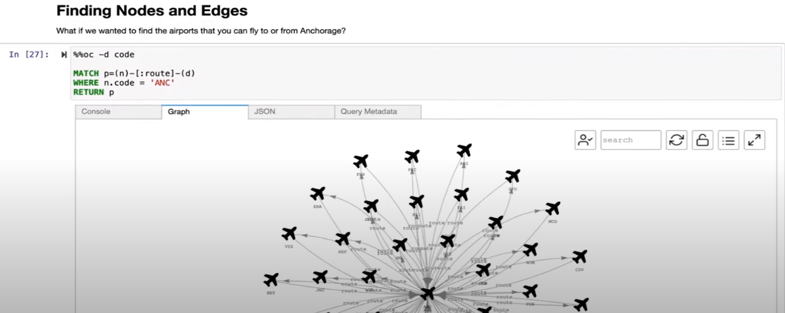

# Chapter 4 - Database Services

## RDS

Without RDS, you could migrate your on-premises DB to AWS EC2, perhaps with the help of Amazon Database Migration Service.

On the other hand, with RDS, you get benefits such as AWS-managed patching, backups, redundancy, failover and disaster recovery.

## Amazon Aurora

A fully managed subtype of RDS. Benefits over normal RDS:
* High availability, with data replicated across facilities, with six copies at any time
* High performance, with up to 15 low-latency read replicasperformance
* Continuous backup to Amazon S3
* Point-in-time recovery

It comes in two flavours: MySQL and PostgreSQL.

It costs as little as 1/10th of the price of commercial databases.

## DynamoDB

Serverless database.

You create a table. The table consists of items. An item is a set of attributes, where an attribute is also called a key-value pair.

DynamoDB is usually a Region level service, across AZs.

However, you can also use the *DynamoDB global tables* feature to create a fully managed, serverless and multi-Region DB. It is also *multi-active*

Millisecond response time.

Not relational. Doesn't support SQL. No schema.

If data doesn't have a strict format and is being accessed extremely frequently, a NoSQL database is a better fit than a relational DB.

DynamoDB can handle over a trillion requests per day, or over 45 million requests per second.

Downside is that you can't query based on all attributes, but only based on certain key attributes. With NoSQL, your queries relate to one table, and do not do joins.

Which DB to choose - RDS or DynamoDB?
* If you must do complex joins, then use a relational database. For example, business analytics applications commonly need this.
* If you do not need to do complex joins but need massive scalability and fast reads and writes, then use a NoSQL database. For example, if you are just storing customer information and only have simple queries of the customer data, then a NoSQL database would be better.

## Redshift

Suitable for doing historical analytics over huge volumes of a huge variety of data. In other words, if you need a data warehouse for big data. Redshift is data warehousing as a service. It can run queries against exabytes of data.

## Database Migration Service

With DMS, the source DB remains fully operational during the migration.

Also, your source and destination DBs can be of different types.

If the source and destination DBs are of the same type, that is called a *homogenous* migration.

The source DB could be located:
* On-premises
* In EC2
* In RDS

The destination DB could be located:
* In EC2
* In RDS

On the other hand, for a *heterogeneous* migration, you must:
1. Convert the schema and code of the source DB to those of the dest DB
2. Migrate data from the converted source DB to the dest DB

Other use cases of DMS:
* Dev and test DB migrations. i.e., Create a copy of the prod DB for dev or testing purposes
* DB consolidation. i.e., Merging multiple DBs into one
* Continuous DB replication

You pay for DMS based on the capacity that you use on a per-hour basis.

## AWS Schema Conversion Tool

This is software that you install and run to convert source database schemas to a form suitable for migration to Amazon.

Source database types include:
* IBM Db2
* Microsoft Azure SQL Database
* Microsoft SQL Server
* MySQL
* Oracle
* Teradata
* Apache Cassandra

Target database types include:
* RDS
* Amazon Aurora DB cluster
* Amazon Redshift clsuter
* EC2-hosted DB
* S3 bucket
* DynamoDB
* AWS Glue
* AWS Step Functions

## Additional database services

Niche DB use cases:
* Amazon DocumentDB: Content management system, like a catalogue or set of user profiles. Stores, queries and indexes JSON data natively. Based on MongoDB
* Amazon Neptune: A graph database, suitable for social networks, recommendation engines and fraud detection. Example use case: finding airports that have flights to or from Anchorage Airport:

* Amazon Managed Blockchain: Highly decentralised ledger system that lets multiple parties run transactions and share data without a central authority
* Amazon Quantum Ledger Database (QLDB): Provides 100% immutability for financial records or supply chain records
* Amazon MemoryDB for Redis: Where you need a fully managed, extremely low latency, high request rate (100 million/s),high throughput (GB/s) and huge DB with a Redis API and no data loss. Use cases: session management, retail inventory tracking, gaming player profiles, payment processing and IoT streaming data. Redis can be thought of as a "data structure server", with support for strings, hashes, lists, sets, sorted sets, streams, and more.

Database accelerators (caches):
* Amazon ElastiCache: A caching layer on top of your DB to improve read times of common requests. Comes in two flavours, that is, memcached or redis
* Amazon DynamoDB Accelerator (DAX): A caching layer for DynamoDB. Improves response times from single-digit milliseconds to microseconds

