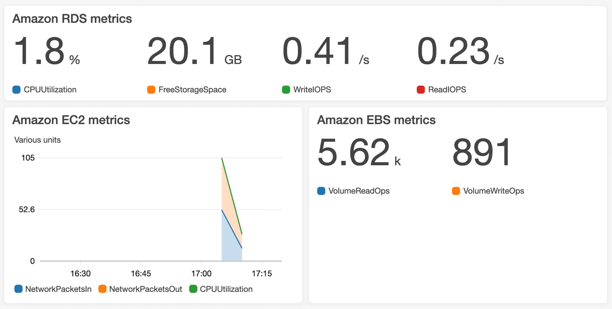

# Chapter 7 - CloudTrail, CloudWatch and AWS Config

## AWS CloudTrail

A record of *events*, where events are actions taken by users, roles and AWS services.

There are three types of events:
* Management events: Info about management operations performed on resources in your AWS account. E.g., attaching a policy to a role, creating a VPC, configuring a security group or deleting a bucket.
* Data events: Info about resource operations performed on or in a resource. E.g., retrieving an object from S3, invoking a Lambda function or pushing to an SNS topic. Disabled by default. Costs extra.
* CloudTrail Insights events: Info about anomalies that are automatically detected from other CloudTrail events. Disabled by default. Costs extra.

## Amazon CloudWatch

You can use CloudWatch to monitor and manage metrics and configure [alarms](https://docs.aws.amazon.com/AmazonCloudWatch/latest/monitoring/AlarmThatSendsEmail.html) based on data from those metrics.

Metrics are variables tied to your resources. E.g., CPU usage of EC2 instance.

Advantages of using CloudWatch:
* Access metrics from a central loction. CloudWatch has dashboards to give you a single pane of glass to help your monitoring.
* Get visibility into your apps, infra and services
* Alert you when things aren't right via CloudWatch alarms. CloudWatch alarms are integrated with SNS.
* Improve MTTR
* Improve TCO
* Automate responses to problems
* Proactively perform routine maintenance in response to metrics being reached. E.g., proactively stop EC2 instances where the CPU usage has remained low for a certain period
* Get insights so you can optimise your applications and costs

A sample CloudWatch dashboard is below:

## AWS Config