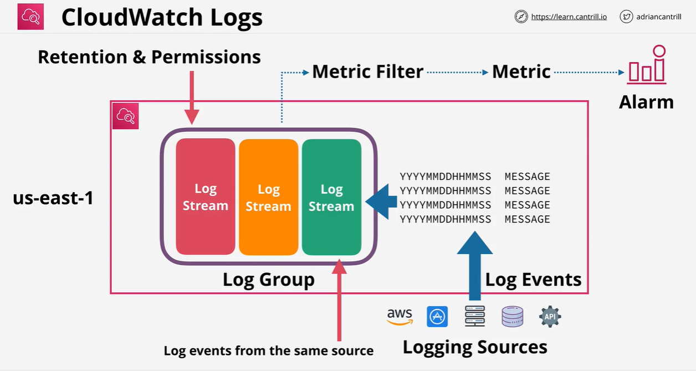

# Chapter 7 - CloudTrail, CloudWatch and AWS Config

## AWS CloudTrail

A record of *events*, where events are actions taken by users, roles and AWS services.

There are three types of events:
* Management events: Also known as control plane operations. They contain info about management operations performed on resources in your AWS account. E.g., attaching a policy to a role, creating a VPC, configuring a security group or deleting a bucket.
* Data events: Info about resource operations performed on or in a *resource*. E.g., retrieving an object from S3, invoking a Lambda function or pushing to an SNS topic. *Disabled by default. Costs extra.*
* CloudTrail Insights events: Info about anomalies that are automatically detected from API activities in your account, e.g., more EC2 instances than usual were launched. *Disabled by default. Costs extra.*

Events can relate to API activity or [non-API activity](https://docs.aws.amazon.com/awscloudtrail/latest/userguide/cloudtrail-non-api-events.html). Examples of non-API activity are:
* AWS service events. That is, activities triggered by AWS services instead of by requests to public AWS APIs. E.g., AWS KMS automatically rotating a customer managed key
* Sign-ins to AWS Management Console

CloudTrail is NOT a real-time service. Events about an API activity are usually logged *15 minutes* after the API call. Such events describe:
* Who made the request
* Which part of the world the request was made from
* When the request was made
* How the request was made, e.g., through CLI
* What the request asked for
* What the response was

CloudTrail is enabled by default.

CloudTrail is a regional service. You create a *trail* and a trail logs events only for the Region that the trail was created in. Global services, including IAM, STS and CloudFront, log events in the us-east-1 Region

In CloudTrail, you create a *trail*. You can create a single-Region trail or a multi-Region trail (also known as an all-Region trail). A multi-Region trail is a collection of trails, one per Region. If AWS adds a new Region in the future, amulti-Region trail will automatically get a new trail in that new region, without you needing to do anything - this is confirmed in the [AWS CloudTrail FAQs](https://aws.amazon.com/cloudtrail/faqs/). By default, the CLI creates a single-Region trail whereas the AWS CloudTrail console creates a multi-Region trail. AWS recommends the use of multi-Region trails.

By default, CloudTrail has no trails, keeps events for 90 days and does NOT store events in S3 or any other AWS service.

However, if you create a trail, then events of that trail will be stored in an S3 bucket and/or CloudWatch Logs. In S3 bucket, the events are stored in compressed JSON format. You could in addition or instead store events in CloudWatch Logs.

You can create an *organization trail*. That is, from the management account of an organization, you can create a trail that logs all events for all AWS accounts in that organization, including the management account. If the trail logs to S3, then the S3 bucket contains the following prefixes:

* *bucket*/Logs/*o-exampleorgid*/*account ID 1*
* *bucket*/Logs/*o-exampleorgid*/*account ID 2*
* *bucket*/Logs/*o-exampleorgid*/*account ID 3*

See [Creating a trail for an organization](https://docs.aws.amazon.com/awscloudtrail/latest/userguide/creating-trail-organization.html).

Note: "When you view events in **Event history** for an organization in AWS Organizations, you can view the events only for the AWS account with which you are signed in. For example, if you are signed in with the organization management account, **Event history** shows the last 90 days of management events for the management account. Organization member account events are not shown in **Event history** for the management account. To view member account events in **Event history**, sign in with the member account."

### Creating an organization trail

Parameters:
* CloudTrail trail name: `Animals4lifeORG`
* CloudTrail trail's IAM role ARN: `arn:aws:iam::ACC1:role/CloudTrailRoleForCloudWatchLogs_Animals4life`
* CloudTrail trail's CloudWatch Logs log group ARN: `arn:aws:logs:us-east-1:<ACC1>:log-group:CloudTrail/aws-cloudtrail-logs-animals4life-org`
* CloudTrail trail's S3 bucket name: `cloudtrail-animals4life-20241225-0720-bk`

We have to complete a few prerequisites.

Firstly, as we will create the organization trail through the API, then we need to enable trusted access for CloudTrail in Organizations, and manually create an Amazon S3 bucket with a policy that allows logging for an organization trail. For details, see: [Creating a trail for an organization with the AWS CLI](https://docs.aws.amazon.com/awscloudtrail/latest/userguide/cloudtrail-create-and-update-an-organizational-trail-by-using-the-aws-cli.html)

The second prerequisite is to complete the [Prepare for creating a trail for your organization](https://docs.aws.amazon.com/awscloudtrail/latest/userguide/creating-an-organizational-trail-prepare.html). This means:

* Creating a [CloudWatch Logs log group](https://boto3.amazonaws.com/v1/documentation/api/latest/reference/services/logs/client/create_log_group.html), `aws-cloudtrail-logs-animals4life-org` to store the trail's events.
* Creating a permissions policy that permits:
    * Writing of events to the S3 bucket
    * Creation of certain CloudWatch Logs log streams
    * Writing of events to those CloudWatch Logs log streams

    cat > cloudtrail_role_permissions_policy.json <<ENDIT
    {
        "Version": "2012-10-17",
        "Statement": [
            {
                "Sid": "AWSCloudTrailCreateLogStreamsAndPutEventsToThem20241225",
                "Effect": "Allow",
                "Action": [
                    "logs:CreateLogStream",
                    "logs:PutLogEvents"
                ],
                "Resource": [
                    "arn:aws:logs:us-east-1:<ACC1>:log-group:CloudTrail/aws-cloudtrail-logs-animals4life-org:log-stream:<ACC1>_CloudTrail_us-east-1*",
                    "arn:aws:logs:us-east-1:<ACC1>:log-group:CloudTrail/aws-cloudtrail-logs-animals4life-org:log-stream:o-fcz4xmiij2_*"
                ]
            }
        ]
    },

Create the log group
    logs_client = boto3.client('logs')

    response = logs_client.create_log_group('aws-cloudtrail-logs-animals4life-org')

Need to create an IAM role for CloudWatch Logs first

    iam_client = boto3.client('iam')

    response = iam_client.create_role(
        RoleName='CloudTrailRoleForCloudWatchLogs_Animals4life',
        AssumeRolePolicyDocument='file://cloudtrail_role_assume_role_policy.json')

Now we can [create the organization trail](https://boto3.amazonaws.com/v1/documentation/api/latest/reference/services/cloudtrail/client/create_trail.html)

    cloudtrail_client = boto3.client('cloudtrail')

    response = cloudtrail_client.create_trail(
        Name='Animals4lifeORG',
        S3BucketName='cloudtrail-animals4life-20241225-0720-bk',
        IncludeGlobalServiceEvents=True,
        IsMultiRegionTrail=True,
        IsOrganizationTrail=True,
        EnableLogFileValidation=True,
        CloudWatchLogsLogGroupArn='arn:aws:logs:us-east-1:<ACC1>:log-group:aws-cloudtrail-logs-animals4life-org',
        CloudWatchLogsRoleArn='arn:aws:iam::<ACC1>:role/CloudTrailRoleForCloudWatchLogs_Animals4life')

Note: By default, trails created via the CloudTrail console have both IsMultiRegionTrail and IncludeGlobalServiceEvents enabled, whereas trails created via the API have both settings disabled.

## Amazon CloudWatch

You can use CloudWatch to monitor and manage metrics and configure [alarms](https://docs.aws.amazon.com/AmazonCloudWatch/latest/monitoring/AlarmThatSendsEmail.html) based on data from those metrics.

Metrics are variables tied to your resources. E.g., CPU usage of EC2 instance.

Advantages of using CloudWatch:
* Access metrics from a central loction. CloudWatch has dashboards to give you a single pane of glass to help your monitoring.
* Get visibility into your apps, infra and services
* Alert you when things aren't right via CloudWatch alarms. CloudWatch alarms are integrated with SNS.
* Improve MTTR
* Improve TCO
* Automate responses to problems
* Proactively perform routine maintenance in response to metrics being reached. E.g., proactively stop EC2 instances where the CPU usage has remained low for a certain period
* Get insights so you can optimise your applications and costs

A sample CloudWatch dashboard is below:

## Amazon CloudWatch Logs

CloudWatch Logs architecture is shown here:

In CloudWatch Logs, a *logging source* (e.g., AWS EC2 instance, AWS Lambda function, an on-prem system or an API) sends *log events* to a *log stream*. Log streams of the same type are put into a *log group*. On a log group, you can define retention and permission settings. On a log group, you can also define *metric filters*, which produce *metrics*, which can in turn produce *alarms* or be exported to other systems. A use case for metric filters is where you have a log stream for the /var/log/messages log file of an EC2 instance, and you have a metric for the number of errors in the log file.

## AWS Config

It's a CMDB of the AWS resources in your AWS accounts, with the following extra features:
* Review changes in configs of, and relationships between, AWS resources
* Check that AWS resources have desired settings
* View resource config history
* Query data from multiple accounts of multiple regions via [aggregators](https://docs.aws.amazon.com/config/latest/developerguide/aggregate-data.html)
