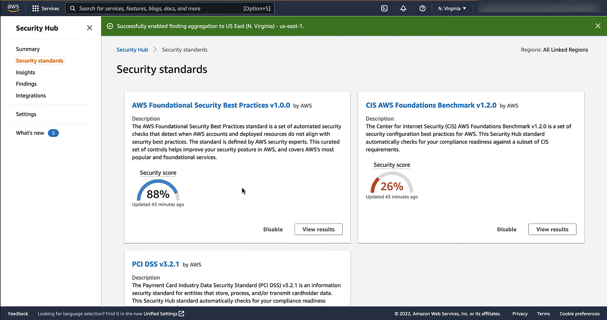
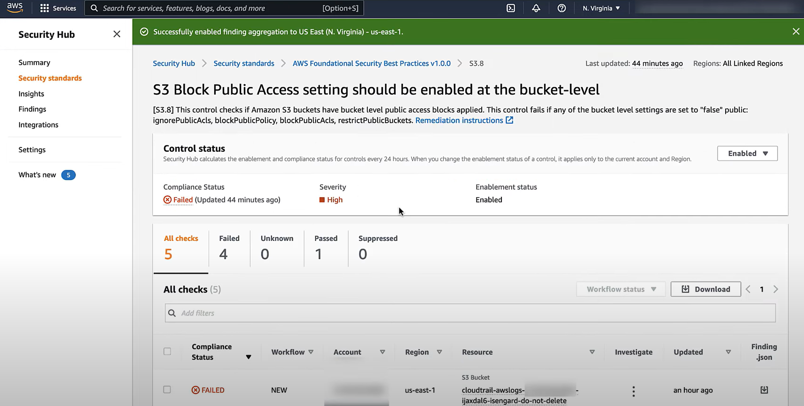

# Chapter 12 - Secure Architectures

## AWS Shared Responsibility Model

AWS is fully responsible for:
* Hardware, software, networking and facilities that run AWS Cloud services
* Physical security of its data centres

AWS and customer "share" responsibility for:
* Patch mgmt - AWS patches its infrastructure; customer patches its guest OSes and apps
* Config mgmt - AWS for its infrastructure; customer for its guest OSes, DBs, apps and its settings for AWS settings
* Training - AWS trains its employees; customer trains its own employees

Customer is totally responsible for their applications

## 1.1S4 Security strategy for multiple AWS accounts

### AWS Organizations

[AWS Organizations documentation](https://docs.aws.amazon.com/organizations/)

Advantages:
* Multi-account management
* Consolidated billing
* Centralised policies (SCPs, tagging policies)

In detail:
* Create AWS accounts programmatically
* Centrally manage multiple AWS accounts programmatically
* Centrally audit, monitor and secure all your accounts. E.g., use the management account's GuardDuty or CloudTrail to alert on and monitor events across all your accounts.
* Channel billing through a single payer
* Define security guardrails across all accounts

#### Creating an organization

    [cloudshell-user@ip-10-130-58-86]~% aws organizations create-organization     
    {
        "Organization": {
            "Id": "<ORG_ID>",
            "Arn": "arn:aws:organizations::<MGMT_ACCT_ID>:organization/<ORG_ID>",
            "FeatureSet": "ALL",
            "MasterAccountArn": "arn:aws:organizations::<MGMT_ACCT_ID>:account/<ORG_ID>/<MGMT_ACCT_ID>",
            "MasterAccountId": "<MGMT_ACCT_ID>",
            "MasterAccountEmail": "peppa@pig.com",
            "AvailablePolicyTypes": [
                {
                    "Type": "SERVICE_CONTROL_POLICY",
                    "Status": "ENABLED"
                }
            ]
        }
    }
    [cloudshell-user@ip-10-130-58-86]~% 

#### Inviting an account to an organization

    [cloudshell-user@ip-10-130-58-86]~% aws organizations invite-account-to-organization --target Type=ACCOUNT,Id=<MEMBER_ACCT_ID> --notes "Please join my awesome organization"
    {
        "Handshake": {
            "Id": "<HANDSHAKE_ID>",
            "Arn": "arn:aws:organizations::<MGMT_ACCT_ID>:handshake/<ORG_ID>/invite/<HANDSHAKE_ID>",
            "Parties": [
                {
                    "Id": "<MEMBER_ACCT_ID>",
                    "Type": "ACCOUNT"
                },
                {
                    "Id": "<ORG_ID_WITHOUT_O_DASH_PREFIX>",
                    "Type": "ORGANIZATION"
                }
            ],
            "State": "OPEN",
            "RequestedTimestamp": "<TIMESTAMP>",
            "ExpirationTimestamp": "<TIMESTAMP>",
            "Action": "INVITE",
            "Resources": [
                {
                    "Value": "<ORG_ID>",
                    "Type": "ORGANIZATION",
                    "Resources": [
                        {
                            "Value": "peppa@pig.com",
                            "Type": "MASTER_EMAIL"
                        },
                        {
                            "Value": "general",
                            "Type": "MASTER_NAME"
                        },
                        {
                            "Value": "ALL",
                            "Type": "ORGANIZATION_FEATURE_SET"
                        }
                    ]
                },
                {
                    "Value": "<MEMBER_ACCT_ID>",
                    "Type": "ACCOUNT"
                },
                {
                    "Value": "Please join my awesome organization",
                    "Type": "NOTES"
                }
            ]
        }
    }

#### Accepting an invitation to join an organization

    [cloudshell-user@ip-10-134-36-221 ~]$ aws organizations list-handshakes-for-account
{
    "Handshakes": [
        {
            "Id": "<HANDSHAKE_ID>",
            "Arn": "arn:aws:organizations::<MGMT_ACCT_ID>:handshake/<ORG_ID>/invite/<HANDSHAKE_ID>",
            ...
        }
    ]
    [cloudshell-user@ip-10-134-36-221 ~]$ aws organizations accept-handshake --handshake-id "<HANDSHAKE_ID>"
    {
        "Handshake": {
            "Id": "<HANDSHAKE_ID>",
            "Arn": "arn:aws:organizations::<MGMT_ACCT_ID>:handshake/<ORG_ID>/invite/<HANDSHAKE_ID>",
            "Parties": [
                {
                    "Id": "<ORG_ID_WITHOUT_O_DASH_PREFIX>",
                    "Type": "ORGANIZATION"
                },
                {
                    "Id": "<MEMBER_ACCT_ID>",
                    "Type": "ACCOUNT"
                }
            ],
            "State": "ACCEPTED",
            "RequestedTimestamp": "<TIMESTAMP>",
            "ExpirationTimestamp": "<TIMESTAMP>",
            "Action": "INVITE",
            "Resources": [
                {
                    "Value": "<ORG_ID>",
                    "Type": "ORGANIZATION",
                    "Resources": [
                        {
                            "Value": "peppa@pig.com",
                            "Type": "MASTER_EMAIL"
                        },
                        {
                            "Value": "oink",
                            "Type": "MASTER_NAME"
                        },
                        {
                            "Value": "ALL",
                            "Type": "ORGANIZATION_FEATURE_SET"
                        }
                    ]
                },
                {
                    "Value": "<MEMBER_ACCT_ID>",
                    "Type": "ACCOUNT"
                },
                {
                    "Value": "Please join my awesome organization",
                    "Type": "NOTES"
                }
            ]
        }
    }

#### Permitting management account to have AdministratorAccess permissions in member account

    [cloudshell-user@ip-10-134-36-221 ~]$ cat > my_assume_role_policy_doc.json <<ENDIT
    {
        "Version": "2012-10-17",
        "Statement": [
            {
                "Effect": "Allow",
                "Principal": {
                    "AWS": "arn:aws:iam::<MGMT_ACCT_ID>:root"
                },
                "Action": "sts:AssumeRole",
                "Condition": {}
            }
        ]
    }
    ENDIT
    [cloudshell-user@ip-10-134-36-221 ~]$ aws iam create-role --role-name OrganizationAccountAccessRole --assume-role-policy-doc file://my_assume_role_policy_doc.json
    {
        "Role": {
            "Path": "/",
            "RoleName": "OrganizationAccountAccessRole",
            "RoleId": "<ROLE_ID>",
            "Arn": "arn:aws:iam::<MEMBER_ACCT_ID>:role/OrganizationAccountAccessRole",
            "CreateDate": "<DATE>",
            "AssumeRolePolicyDocument": {
                "Version": "2012-10-17",
                "Statement": [
                    {
                        "Effect": "Allow",
                        "Principal": {
                            "AWS": "arn:aws:iam::<MGMT_ACCT_ID>:root"
                        },
                        "Action": "sts:AssumeRole",
                        "Condition": {}
                    }
                ]
            }
        }
    }
    [cloudshell-user@ip-10-134-36-221 ~]$ aws iam get-policy --policy-arn "arn:aws:iam::aws:policy/AdministratorAccess"
    {
        "Policy": {
            "PolicyName": "AdministratorAccess",
            "PolicyId": "<IAM_POLICY_ID>",
            "Arn": "arn:aws:iam::aws:policy/AdministratorAccess",
            "Path": "/",
            "DefaultVersionId": "v1",
            "AttachmentCount": 1,
            "PermissionsBoundaryUsageCount": 0,
            "IsAttachable": true,
            "Description": "Provides full access to AWS services and resources.",
            "CreateDate": "<DATE>",
            "UpdateDate": "<DATE>",
            "Tags": []
        }
    }
    [cloudshell-user@ip-10-134-36-221 ~]$ aws iam attach-role-policy --role-name OrganizationAccountAccessRole --policy-arn "arn:aws:iam::aws:policy/AdministratorAccess"
    [cloudshell-user@ip-10-134-36-221 ~]$ 

Now, from the general (management) account, I can switch role (assume role) to the member account's OrganizationAccountAccessRole role.

#### Creating an account within an organization

Use the [organization.create_account](https://boto3.amazonaws.com/v1/documentation/api/latest/reference/services/organizations/client/create_account.html) API.

Creating an account is an asynchronous request and can take a few minutes. You can check the status of the request through the [organization.describe_create_account_status](https://boto3.amazonaws.com/v1/documentation/api/latest/reference/services/organizations/client/describe_create_account_status.html) API:

    [cloudshell-user@ip-10-130-48-194]~% python
    Python 3.9.20 (main, Dec 11 2024, 00:00:00) 
    [GCC 11.4.1 20230605 (Red Hat 11.4.1-2)] on linux
    Type "help", "copyright", "credits" or "license" for more information.
    >>> import boto3
    >>> org = boto3.client('organizations')
    >>> response = org.create_account(
    ...     Email='mydevaccount@gmail.com',
    ...     AccountName='development',
    ...     IamUserAccessToBilling='DENY'
    ... )
    >>> import pprint
    >>> pprint.pprint(response)
    {'CreateAccountStatus': {'AccountName': 'development',
                             'Id': '<CREATE_ACCOUNT_REQ_ID>',
                             'RequestedTimestamp': datetime.datetime(<YYYY>, <MM>, <DD>, <hh>, <mm>, <ss>, tzinfo=<TIMEZONE>),
                             'State': 'IN_PROGRESS'},
     'ResponseMetadata': {'HTTPHeaders': {'content-length': '157',
                                          'content-type': 'application/x-amz-json-1.1',
                                          'date': '<DATE>',
                                          'x-amzn-requestid': '<REQ_ID>'},
                          'HTTPStatusCode': 200,
                          'RequestId': '<REQ_ID>',
                          'RetryAttempts': 0}}

Notice how the state is 'IN_PROGRESS' and no account ID is listed. 

Checking the status of the account creation request:

    >>> pprint.pprint(org.describe_create_account_status(CreateAccountRequestId='<CREATE_ACCOUNT_REQ_ID>'))
    {'CreateAccountStatus': {'AccountId': '<DEV_ACCT_ID>',
                             'AccountName': 'development',
                             'CompletedTimestamp': datetime.datetime(<YYYY>, <MM>, <DD>, <hh>, <mm>, <ss>, tzinfo=<TIMEZONE>),
                             'Id': '<CREATE_ACCOUNT_REQ_ID>',
                             'RequestedTimestamp': datetime.datetime(<YYYY>, <MM>, <DD>, <hh>, <mm>, <ss>, tzinfo=<TIMEZONE>),
                             'State': 'SUCCEEDED'},
     'ResponseMetadata': {'HTTPHeaders': {'content-length': '219',
                                          'content-type': 'application/x-amz-json-1.1',
                                          'date': '<DATE>',
                                          'x-amzn-requestid': '<REQ_ID>'},
                          'HTTPStatusCode': 200,
                          'RequestId': '<REQ_ID>',
                          'RetryAttempts': 0}}
    >>> 

I can assume the OrganizationAccountAccessRole role to the new account:

    [cloudshell-user@ip-10-130-48-194]~% aws sts assume-role --role-arn arn:aws:iam::411226677998:role/OrganizationAccountAccessRole --role-session-name 'dev'

#### Creating OUs

    [cloudshell-user@ip-10-134-36-13 ~]$ python3
    Python 3.9.20 (main, Dec 11 2024, 00:00:00) 
    [GCC 11.4.1 20230605 (Red Hat 11.4.1-2)] on linux
    Type "help", "copyright", "credits" or "license" for more information.
    >>> import boto3
    >>> client = boto3.client('organizations')
    >>> from pprint import pprint
    >>> pprint(client.list_children(
    ...     ParentId='<ORG_ID>',
    ...     ChildType='ACCOUNT'
    ... )
    ... 
    ... )
    Traceback (most recent call last):
      File "<stdin>", line 1, in <module>
      File "/usr/local/lib/python3.9/site-packages/botocore/client.py", line 569, in _api_call
        return self._make_api_call(operation_name, kwargs)
      File "/usr/local/lib/python3.9/site-packages/botocore/client.py", line 1023, in _make_api_call
        raise error_class(parsed_response, operation_name)
    botocore.errorfactory.InvalidInputException: An error occurred (InvalidInputException) when calling the ListChildren operation: You provided a value that does not match the required pattern.
    >>> pprint(client.list_children(
    ...     ParentId='<ROOT_OU_ID>',
    ...     ChildType='ACCOUNT'
    ... ))
    {'Children': [{'Id': '<MGMT_ACCT_ID>', 'Type': 'ACCOUNT'},
                  {'Id': '<DEV_ACCT_ID_>', 'Type': 'ACCOUNT'},
                  {'Id': '<PROD_ACCT_ID>', 'Type': 'ACCOUNT'}],
     'ResponseMetadata': {'HTTPHeaders': {'content-length': '131',
                                          'content-type': 'application/x-amz-json-1.1',
                                          'date': '<DATE>',
                                          'x-amzn-requestid': '<REQ_ID>'},
                          'HTTPStatusCode': 200,
                          'RequestId': '<REQ_ID>',
                          'RetryAttempts': 0}}
    >>> pprint(client.list_children(
    ...     ParentId='<ROOT_OU_ID>',
    ...     ChildType='ORGANIZATIONAL_UNIT'
    ... ))
    {'Children': [],
     'ResponseMetadata': {'HTTPHeaders': {'content-length': '15',
                                          'content-type': 'application/x-amz-json-1.1',
                                          'date': '<DATE>',
                                          'x-amzn-requestid': '<REQ_ID>'},
                          'HTTPStatusCode': 200,
                          'RequestId': '<REQ_ID>',
                          'RetryAttempts': 0}}
    >>> pprint(client.describe_account(AccountId='<MEMBER_ACCT_ID_1>'))
    {'Account': {'Arn': 'arn:aws:organizations::<MGMT_ACCT_ID>:account/<ORG_ID>/<MEMBER_ACCT_ID_1>',
                 'Email': '<MEMBER_ACCT_ID_1_EMAIL>',
                 'Id': '<MEMBER_ACCT_ID_1>',
                 'JoinedMethod': 'CREATED',
                 'JoinedTimestamp': datetime.datetime(<YYYY>, <MM>, <DD>, <hh>, <mm>, <ss>, tzinfo=<TIMEZONE>),
                 'Name': 'development',
                 'Status': 'ACTIVE'},
     'ResponseMetadata': {'HTTPHeaders': {'content-length': '249',
                                          'content-type': 'application/x-amz-json-1.1',
                                          'date': '<DATE>',
                                          'x-amzn-requestid': '<REQ_ID>'},
                          'HTTPStatusCode': 200,
                          'RequestId': '<REQ_ID>',
                          'RetryAttempts': 0}}
    >>> pprint(client.describe_organization())
    {'Organization': {'Arn': 'arn:aws:organizations::<MGMT_ACCT_ID>:organization/<ORG_ID>',
                      'AvailablePolicyTypes': [{'Status': 'ENABLED',
                                                'Type': 'SERVICE_CONTROL_POLICY'}],
                      'FeatureSet': 'ALL',
                      'Id': '<ORG_ID>',
                      'MasterAccountArn': 'arn:aws:organizations::<MGMT_ACCT_ID>:account/<ORG_ID>/<MGMT_ACCT_ID>',
                      'MasterAccountEmail': '<MGMT_ACCT_EMAIL>',
                      'MasterAccountId': '<MGMT_ACCT_ID>'},
     'ResponseMetadata': {'HTTPHeaders': {'content-length': '385',
                                          'content-type': 'application/x-amz-json-1.1',
                                          'date': '<DATE>',
                                          'x-amzn-requestid': '<REQ_ID>'},
                          'HTTPStatusCode': 200,
                          'RequestId': '<REQ_ID>',
                          'RetryAttempts': 0}}
    >>> response = client.create_organizational_unit(ParentId='<ROOT_OU_ID>', Name='PROD')
    >>> pprint(response)
    {'OrganizationalUnit': {'Arn': 'arn:aws:organizations::<MGMT_ACCT_ID>:ou/<ORG_ID>/<PROD_OU_ID>',
                            'Id': '<PROD_OU_ID>',
                            'Name': 'PROD'},
     'ResponseMetadata': {'HTTPHeaders': {'content-length': '139',
                                          'content-type': 'application/x-amz-json-1.1',
                                          'date': '<DATE>',
                                          'x-amzn-requestid': '<REQ_ID>'},
                          'HTTPStatusCode': 200,
                          'RequestId': '<REQ_ID>',
                          'RetryAttempts': 0}}
    >>> response = client.create_organizational_unit(ParentId='<ROOT_OU_ID>', Name='DEV')
    >>> pprint(response)
    {'OrganizationalUnit': {'Arn': 'arn:aws:organizations::<MGMT_ACCT_ID>:ou/<ORG_ID>/<DEV_OU_ID>',
                            'Id': '<DEV_OU_ID>',
                            'Name': 'DEV'},
     'ResponseMetadata': {'HTTPHeaders': {'content-length': '138',
                                          'content-type': 'application/x-amz-json-1.1',
                                          'date': '<DATE>',
                                          'x-amzn-requestid': '<REQ_ID>'},
                          'HTTPStatusCode': 200,
                          'RequestId': '<REQ_ID>',
                          'RetryAttempts': 0}}
    >>> response = client.list_children(ParentId='<ROOT_OU_ID>', ChildType='ORGANIZATIONAL_UNIT')
    >>> pprint(response)
    {'Children': [{'Id': '<DEV_OU_ID>', 'Type': 'ORGANIZATIONAL_UNIT'},
                  {'Id': '<PROD_OU_ID>', 'Type': 'ORGANIZATIONAL_UNIT'}],
     'ResponseMetadata': {'HTTPHeaders': {'content-length': '124',
                                          'content-type': 'application/x-amz-json-1.1',
                                          'date': '<DATE>',
                                          'x-amzn-requestid': '<REQ_ID>'},
                          'HTTPStatusCode': 200,
                          'RequestId': '<REQ_ID>',
                          'RetryAttempts': 0}}
    >>> response = client.describe_organizational_unit(OrganizationalUnitId='<DEV_OU_ID>')
    >>> pprint(response)
    {'OrganizationalUnit': {'Arn': 'arn:aws:organizations::<MGMT_ACCT_ID>:ou/<ORG_ID>/<DEV_OU_ID>',
                            'Id': '<DEV_OU_ID>',
                            'Name': 'DEV'},
     'ResponseMetadata': {'HTTPHeaders': {'content-length': '138',
                                          'content-type': 'application/x-amz-json-1.1',
                                          'date': '<DATE>',
                                          'x-amzn-requestid': '<REQ_ID>'},
                          'HTTPStatusCode': 200,
                          'RequestId': '<REQ_ID>',
                          'RetryAttempts': 0}}
    >>> 

#### Moving accounts between OUs

    [cloudshell-user@ip-10-132-74-43 ~]$ python
    Python 3.9.20 (main, Dec 11 2024, 00:00:00) 
    [GCC 11.4.1 20230605 (Red Hat 11.4.1-2)] on linux
    Type "help", "copyright", "credits" or "license" for more information.
    >>> import boto3
    from>>> 
    >>> from pprint import pprint
    >>> client = boto3.client('organizations')
    >>> response = client.move_account(AccountId='<DEV_ACCT_ID>', SourceParentId='<ROOT_OU_ID>', DestinationParentId='<DEV_OU_ID>')
    >>> pprint(response)
    {'ResponseMetadata': {'HTTPHeaders': {'content-length': '0',
                                          'content-type': 'application/x-amz-json-1.1',
                                          'date': '<DATE>',
                                          'x-amzn-requestid': '<REQ_ID>'},
                          'HTTPStatusCode': 200,
                          'RequestId': '<REQ_ID>',
                          'RetryAttempts': 0}}
    >>> response = client.list_children(ParentId='<DEV_OU_ID>', ChildType='ACCOUNT')
    >>> pprint(response)
    {'Children': [{'Id': '<DEV_ACCT_ID>', 'Type': 'ACCOUNT'}],
     'ResponseMetadata': {'HTTPHeaders': {'content-length': '53',
                                          'content-type': 'application/x-amz-json-1.1',
                                          'date': '<DATE>',
                                          'x-amzn-requestid': '<REQ_ID>'},
                          'HTTPStatusCode': 200,
                          'RequestId': '<REQ_ID>',
                          'RetryAttempts': 0}}
    >>> response = client.list_children(ParentId='<DEV_OU_ID>', ChildType='ORGANIZATIONAL_UNIT')                                                                                                                 
    >>> pprint(response)
    {'Children': [],
     'ResponseMetadata': {'HTTPHeaders': {'content-length': '15',
                                          'content-type': 'application/x-amz-json-1.1',
                                          'date': '<DATE>',
                                          'x-amzn-requestid': '<REQ_ID>'},
                          'HTTPStatusCode': 200,
                          'RequestId': '<REQ_ID>',
                          'RetryAttempts': 0}}
    >>> from pprint import pprint as pp
    >>> response = client.move_account(AccountId='<PROD_ACCT_ID>', SourceParentId='<ROOT_OU_ID>', DestinationParentId='<PROD_OU_ID>')                                                                                     
    >>> pp(response)
    {'ResponseMetadata': {'HTTPHeaders': {'content-length': '0',
                                          'content-type': 'application/x-amz-json-1.1',
                                          'date': '<DATE>',
                                          'x-amzn-requestid': '<REQ_ID>'},
                          'HTTPStatusCode': 200,
                          'RequestId': '<REQ_ID>',
                          'RetryAttempts': 0}}
    >>> response = client.list_children(ParentId='<PROD_OU_ID>', ChildType='ACCOUNT')
    >>> pp(response)
    {'Children': [{'Id': '<PROD_ACCT_ID>', 'Type': 'ACCOUNT'}],
     'ResponseMetadata': {'HTTPHeaders': {'content-length': '53',
                                          'content-type': 'application/x-amz-json-1.1',
                                          'date': '<DATE>',
                                          'x-amzn-requestid': '<REQ_ID>'},
                          'HTTPStatusCode': 200,
                          'RequestId': '<REQ_ID>',
                          'RetryAttempts': 0}}
    >>> response = client.list_children(ParentId='<PROD_OU_ID>', ChildType='ORGANIZATIONAL_UNIT')
    >>> pp(response)
    {'Children': [],
     'ResponseMetadata': {'HTTPHeaders': {'content-length': '15',
                                          'content-type': 'application/x-amz-json-1.1',
                                          'date': '<DATE>',
                                          'x-amzn-requestid': '<REQ_ID>'},
                          'HTTPStatusCode': 200,
                          'RequestId': '<REQ_ID>',
                          'RetryAttempts': 0}}
    >>> 

### Service Control Policies (SCPs)

* SCPs do NOT affect the management account of an organisation, as confirmed [here](https://docs.aws.amazon.com/organizations/latest/userguide/orgs_best-practices_mgmt-acct.html#bp_mgmt-acct_use-mgmt). Hence, it is better that you use the management accounts only for tasks that require the management account. Such tasks, listed [here](https://docs.aws.amazon.com/organizations/latest/APIReference/action-reference.html#actions-management-account), comprise most of the API operations of AWS Organizations.
* SCPs restrict what an account can do. Since a root user has full access to an account, then SCPs indirectly restrict what the root user can do.
* SCPs have a default deny policy but the default SCP grants access to everything. If you remove the default SCP, then the default deny takes effect.
* SCPs can be applied to all accounts, to OUs or to individual accounts.
* An `Allow` statement in an SCP cannot have a `Condition` element at all.
* A `Deny` statement in an SCP *can* have a `Condition` element.
* Both `Allow` and `Deny` statements permit the `Resource` element to have only a `"*"` entry.
* For a permission to be **allowed** for a specific account, every level from the root through each OU in the direct path to the account (including the target account itself) must have an **explicit `Allow` statement**.

#### SCP syntax

Similar to IAM permission policies and resource-based policies (like S3 bucket policies). See [IAM JSON policy element reference](https://docs.aws.amazon.com/IAM/latest/UserGuide/reference_policies_elements.html)

Has a maximum size of 5120 characters, including whitespace.

    {
        "Version": "2012-10-17",
        "Statement": {
            "Sid": ,
            "Action" or "NotAction" (mutually exclusive): 
            "Condition": ,
            "Effect": ,
            "Resource": 
        }
    }

Notes:

* For `Resource`:
    * If `Effect` is `Allow`, then `Resource` must be `*`. You can't specify individual ARNs.
    * If `Effect` is `Deny`, then you *can* specify individual ARNs.
* The `*` and `?` wildcards are supported in `Action`, `NotAction` and `Resource`.

Unsupported elements:

* `Principal`
* `NotPrinciple`
* `NotResource`

#### Enabling SCPs in the organization

By default, SCPs are disabled. Let's enable them:

    >>> org_client = boto3.client('organizations')
    >>> from pprint import pp
    >>> response = org_client.enable_policy_type(RootId='<ROOT_OU_ID>', PolicyType='SERVICE_CONTROL_POLICY')
    >>> pp(response)
    {'Root': {'Id': '<ROOT_OU_ID>',
              'Arn': 'arn:aws:organizations::<MGMT_ACCT_ID>:root/<ORG_ID>/<ROOT_OU_ID>',
              'Name': 'Root',
              'PolicyTypes': []},
     'ResponseMetadata': {'RequestId': '<REQ_ID>',
                          'HTTPStatusCode': 200,
                          'HTTPHeaders': {'x-amzn-requestid': '<REQ_ID>',
                                          'content-type': 'application/x-amz-json-1.1',
                                          'content-length': '124',
                                          'date': '<DATE>'},
                          'RetryAttempts': 0}}
    >>> 

#### Create SCP that allows all actions except S3 actions

    >>> print(deny_s3_policy_string)
    {
        "Version": "2012-10-17",
        "Statement": [
            {
                "Effect": "Allow",
                "Action": "*",
                "Resource": "*"
            },
            {
                "Effect": "Deny",
                "Action": "s3:*",
                "Resource": "*"
            }
        ]
    }

    >>> print(repr(deny_s3_policy_string))
    '{\n    "Version": "2012-10-17",\n    "Statement": [\n        {\n            "Effect": "Allow",\n            "Action": "*",\n            "Resource": "*"\n        },\n        {\n            "Effect": "Deny",\n            "Action": "s3:*",\n            "Resource": "*"\n        }\n    ]\n}\n'
    >>> response = org_client.create_policy(Content=deny_s3_policy_string, Description='Allow all but S3', Name='AllowAllButS3', Type='SERVICE_CONTROL_POLICY')
    >>> pp(response)
    {'Policy': {'PolicySummary': {'Id': '<SCP_ID>',
                                  'Arn': 'arn:aws:organizations::<MGMT_ACCT_ID>:policy/<ORG_ID>/service_control_policy/<SCP_ID>',
                                  'Name': 'AllowAllButS3',
                                  'Description': 'Allow all but S3',
                                  'Type': 'SERVICE_CONTROL_POLICY',
                                  'AwsManaged': False},
                'Content': '{\n'
                           '    "Version": "2012-10-17",\n'
                           '    "Statement": [\n'
                           '        {\n'
                           '            "Effect": "Allow",\n'
                           '            "Action": "*",\n'
                           '            "Resource": "*"\n'
                           '        },\n'
                           '        {\n'
                           '            "Effect": "Deny",\n'
                           '            "Action": "s3:*",\n'
                           '            "Resource": "*"\n'
                           '        }\n'
                           '    ]\n'
                           '}\n'},
     'ResponseMetadata': {'RequestId': '<REQ_ID>',
                          'HTTPStatusCode': 200,
                          'HTTPHeaders': {'x-amzn-requestid': '<REQ_ID>',
                                          'content-type': 'application/x-amz-json-1.1',
                                          'content-length': '584',
                                          'date': '<DATE>'},
                          'RetryAttempts': 0}}
    >>> 

#### Attach SCP to DEV OU

    [cloudshell-user@ip-10-130-78-11 ~]$ python3
    Python 3.9.20 (main, Dec 11 2024, 00:00:00) 
    [GCC 11.4.1 20230605 (Red Hat 11.4.1-2)] on linux
    Type "help", "copyright", "credits" or "license" for more information.
    >>> import boto3
    >>> from pprint import pp
    >>> org_client = boto3.client('organizations')
    >>> response = org_client.attach_policy(PolicyId='<SCP_ID>', TargetId='<DEV_OU_ID>')
    >>> pp(response)
    {'ResponseMetadata': {'RequestId': '<REQ_ID>',
                          'HTTPStatusCode': 200,
                          'HTTPHeaders': {'x-amzn-requestid': '<REQ_ID>',
                                          'content-type': 'application/x-amz-json-1.1',
                                          'content-length': '0',
                                          'date': '<DATE>'},
                          'RetryAttempts': 0}}
    >>> response = org_client.list_policies_for_target(TargetId='<DEV_OU_ID>', Filter='SERVICE_CONTROL_POLICY')
    >>> pp(response)
    {'Policies': [{'Id': 'p-FullAWSAccess',
                   'Arn': 'arn:aws:organizations::aws:policy/service_control_policy/p-FullAWSAccess',
                   'Name': 'FullAWSAccess',
                   'Description': 'Allows access to every operation',
                   'Type': 'SERVICE_CONTROL_POLICY',
                   'AwsManaged': True},
                  {'Id': '<SCP_ID>',
                   'Arn': 'arn:aws:organizations::<MGMT_ACCT_ID>:policy/<ORG_ID>/service_control_policy/<SCP_ID>',
                   'Name': 'AllowAllButS3',
                   'Description': 'Allow all but S3',
                   'Type': 'SERVICE_CONTROL_POLICY',
                   'AwsManaged': False}],
     'ResponseMetadata': {'RequestId': '<REQ_ID>',
                          'HTTPStatusCode': 200,
                          'HTTPHeaders': {'x-amzn-requestid': '<REQ_ID>',
                                          'content-type': 'application/x-amz-json-1.1',
                                          'content-length': '467',
                                          'date': '<DATE>'},
                          'RetryAttempts': 0}}
    >>> 

#### Verify dev account has no permissions

    >> response = sts_client.assume_role(RoleArn='arn:aws:iam::<DEV_ACCT_ID>:role/OrganizationAccountAccessRole', RoleSessionName='DEV')
    >>> pp(response)
    {'Credentials': {'AccessKeyId': 'ASIA...',
                     'SecretAccessKey': 'O/xZb...',
                     'SessionToken': 'FwoG...,
                     'Expiration': datetime.datetime(<YYYY>, <MM>, <DD>, <hh>, <mm>, <ss>, tzinfo=<TIMEZONE>)},
     'AssumedRoleUser': {'AssumedRoleId': 'AROAT....:DEV',
                         'Arn': 'arn:aws:sts::<DEV_ACCT_ID>:assumed-role/OrganizationAccountAccessRole/DEV'},
     'ResponseMetadata': {'RequestId': '<REQ_ID>',
                          'HTTPStatusCode': 200,
                          'HTTPHeaders': {'x-amzn-requestid': '<REQ_ID>',
                                          'content-type': 'text/xml',
                                          'content-length': '1038',
                                          'date': '<DATE>'},
                          'RetryAttempts': 0}}
    >>> creds = response['Credentials']
    >>> dev_s3_client = boto3.client('s3', aws_access_key_id=creds['AccessKeyId'], aws_secret_access_key=creds['SecretAccessKey'], aws_session_token=creds['SessionToken'])
    >>> pp(dev_s3_client)
    <botocore.client.S3 object at 0x7fd4bbd6c820>
    >>> response = dev_s3_client.list_buckets()
    Traceback (most recent call last):
      File "<stdin>", line 1, in <module>
      File "/usr/local/lib/python3.9/site-packages/botocore/client.py", line 569, in _api_call
        return self._make_api_call(operation_name, kwargs)
      File "/usr/local/lib/python3.9/site-packages/botocore/client.py", line 1023, in _make_api_call
        raise error_class(parsed_response, operation_name)
    botocore.exceptions.ClientError: An error occurred (AccessDenied) when calling the ListBuckets operation: User: arn:aws:sts::<DEV_ACCT_ID>:assumed-role/OrganizationAccountAccessRole/DEV is not authorized to perform: s3:ListAllMyBuckets with an explicit deny in a service control policy
    >>> 

#### Remove SCP

Must detach SCP from all targets first. 

    >>> response = org_client.detach_policy(PolicyId='<SCP_ID>', TargetId='<DEV_OU_ID>')
    >>> pp(response)
    {'ResponseMetadata': {'RequestId': '<REQ_ID>',
                          'HTTPStatusCode': 200,
                          'HTTPHeaders': {'x-amzn-requestid': '<REQ_ID>',
                                          'content-type': 'application/x-amz-json-1.1',
                                          'content-length': '0',
                                          'date': '<DATE>'},
                          'RetryAttempts': 0}}
    >>> 

Check can list S3 buckets in DEV

    >>> response = dev_s3_client.list_buckets()
    >>> pp(response)
    {'ResponseMetadata': {'RequestId': '<REQ_ID>',
                          'HostId': '<HOST_ID>',
                          'HTTPStatusCode': 200,
                          'HTTPHeaders': {'x-amz-id-2': '<ID>',
                                          'x-amz-request-id': '<REQ_ID>',
                                          'date': '<DATE>',
                                          'content-type': 'application/xml',
                                          'transfer-encoding': 'chunked',
                                          'server': 'AmazonS3'},
                          'RetryAttempts': 0},
     'Buckets': [{'Name': 'catpics-20241223-0731',
                  'CreationDate': datetime.datetime(<YYYY>, <MM>, <DD>, <hh>, <mm>, <ss>, tzinfo=<TIMEZONE>)}],
     'Owner': {'DisplayName': '<DEV_ACCT_DISPLAY_NAME>',
               'ID': '<ID>'}}
    >>> 

Delete SCP

    >>> response = org_client.delete_policy(PolicyId='<SCP_ID>')
    >>> pp(response)
    {'ResponseMetadata': {'RequestId': '<REQ_ID>',
                          'HTTPStatusCode': 200,
                          'HTTPHeaders': {'x-amzn-requestid': '<REQ_ID>',
                                          'content-type': 'application/x-amz-json-1.1',
                                          'content-length': '0',
                                          'date': '<DATE>'},
                          'RetryAttempts': 0}}
    >>> 

#### Delete bucket

Must empty the bucket first

    >>> response = dev_s3_client.delete_bucket(Bucket='catpics-20241223-0731')
    Traceback (most recent call last):
      File "<stdin>", line 1, in <module>
      File "/usr/local/lib/python3.9/site-packages/botocore/client.py", line 569, in _api_call
        return self._make_api_call(operation_name, kwargs)
      File "/usr/local/lib/python3.9/site-packages/botocore/client.py", line 1023, in _make_api_call
        raise error_class(parsed_response, operation_name)
    botocore.exceptions.ClientError: An error occurred (BucketNotEmpty) when calling the DeleteBucket operation: The bucket you tried to delete is not empty
    >>> response = dev_s3_client.list_objects_v2(Bucket='catpics-20241223-0731')
    >>> pp(response)
    {'ResponseMetadata': {'RequestId': '<REQ_ID>',
                          'HostId': '<HOST_ID>',
                          'HTTPStatusCode': 200,
                          'HTTPHeaders': {'x-amz-id-2': '<ID>',
                                          'x-amz-request-id': '<REQ_ID>',
                                          'date': '<DATE>',
                                          'x-amz-bucket-region': 'ap-southeast-2',
                                          'content-type': 'application/xml',
                                          'transfer-encoding': 'chunked',
                                          'server': 'AmazonS3'},
                          'RetryAttempts': 0},
     'IsTruncated': False,
     'Contents': [{'Key': 'samson.jpg',
                   'LastModified': datetime.datetime(<YYYY>, <MM>, <DD>, <hh>, <mm>, <ss>, tzinfo=<TIMEZONE>),
                   'ETag': '"<ETAG_ID>"',
                   'ChecksumAlgorithm': ['CRC64NVME'],
                   'Size': 1387621,
                   'StorageClass': 'STANDARD'}],
     'Name': 'catpics-20241223-0731',
     'Prefix': '',
     'MaxKeys': 1000,
     'EncodingType': 'url',
     'KeyCount': 1}
    >>> response = dev_s3_client.delete_object(Bucket='catpics-20241223-0731', Key='samson.jpg')
    >>> pp(response)
    {'ResponseMetadata': {'RequestId': '<REQ_ID>',
                          'HostId': '<HOST_ID>',
                          'HTTPStatusCode': 204,
                          'HTTPHeaders': {'x-amz-id-2': '<ID>',
                                          'x-amz-request-id': '<REQ_ID>',
                                          'date': '<DATE>',
                                          'server': 'AmazonS3'},
                          'RetryAttempts': 0}}
    >>> response = dev_s3_client.list_objects_v2(Bucket='catpics-20241223-0731')
    >>> pp(response)
    {'ResponseMetadata': {'RequestId': '<REQ_ID>',
                          'HostId': '<HOST_ID>',
                          'HTTPStatusCode': 200,
                          'HTTPHeaders': {'x-amz-id-2': '<ID>',
                                          'x-amz-request-id': '<REQ_ID>',
                                          'date': '<DATE>',
                                          'x-amz-bucket-region': 'ap-southeast-2',
                                          'content-type': 'application/xml',
                                          'transfer-encoding': 'chunked',
                                          'server': 'AmazonS3'},
                          'RetryAttempts': 0},
     'IsTruncated': False,
     'Name': 'catpics-20241223-0731',
     'Prefix': '',
     'MaxKeys': 1000,
     'EncodingType': 'url',
     'KeyCount': 0}

Now we can delete the bucket because it is empty

    >>> response = dev_s3_client.delete_bucket(Bucket='catpics-20241223-0731')
    >>> pp(response)
    {'ResponseMetadata': {'RequestId': '<REQ_ID>',
                          'HostId': '<HOST_ID>',
                          'HTTPStatusCode': 204,
                          'HTTPHeaders': {'x-amz-id-2': '<ID>',
                                          'x-amz-request-id': '<REQ_ID>',
                                          'date': '<DATE>',
                                          'server': 'AmazonS3'},
                          'RetryAttempts': 0}}
    >>> response = dev_s3_client.list_buckets()
    >>> pp(response)
    {'ResponseMetadata': {'RequestId': '<REQ_ID>',
                          'HostId': '<HOST_ID>',
                          'HTTPStatusCode': 200,
                          'HTTPHeaders': {'x-amz-id-2': '<ID>',
                                          'x-amz-request-id': '<REQ_ID>',
                                          'date': '<DATE>',
                                          'content-type': 'application/xml',
                                          'transfer-encoding': 'chunked',
                                          'server': 'AmazonS3'},
                          'RetryAttempts': 0},
     'Buckets': [],
     'Owner': {'DisplayName': '<DEV_ACCT_DISPLAY_NAME>',
               'ID': '<ID>'}}
    >>> 
## Compliance

AWS complies with many standards, such as HIPAA, ISO 9001, ISO 27001, NIST and PCI.

AWS Artifact provides the compliance reports and lets you accept agreements for specific regulations

More helpful resources to help you pass third-party compliance checks of AWS are:
* [AWS Customer Compliance Center](https://aws.amazon.com/compliance/customer-center/)
* [AWS Compliance FAQ](https://aws.amazon.com/compliance/faq/)
* [AWS Risk and Compliance whitepaper](https://docs.aws.amazon.com/whitepapers/latest/aws-risk-and-compliance/welcome.html?did=wp_card&trk=wp_card)

## DDOS

Common DDOS attacks:
* UDP flood: You should configure security groups to block it
* Slowloris: You should direct customers to ELB, where ELB is massively scalable
* HTTP level attacks: You should use a combination of AWS WAF and AWS Shield, preferably AWS Shield Advanced, to block it

AWS Shield Standard is enabled by default at no additional charge. To get the most out of it, you should use Amazon CloudFront standard distributions, Amazon Route 53 hosted zones and AWS Global Accelerator standard accelerators.

AWS Shield Advanced is a paid service. It extends AWS Shield Standard and protects other AWS services, like ELB, resources associated with EIPs.

## AWS WAF

A web application firewall that monitors for suspicious web requests via HTTP and HTTPS to several AWS resources, mainly:
* CloudFront distribution
* API Gateway REST API
* ALB
* AppSync GraphQL API

If suspicious web requests are detected, AWS WAF can allow, block or count them

Types of suspicious web requests detected are:
* Suspicious source address
* SQLi
* XSS
* Custom patterns

## Encryption

At-rest:
* Server-side encryption at rest is enabled on all DynamoDB table data, and integrates with KMS

In-transit:
* SSL/TLS. Possible with SQS, RDS, S3, RedShift and many more AWS services

## Amazon Inspector
Performs network assessments and host assessments so you can identify and remediate vulnerabilities

## Amazon GuardDuty
Identify threats through data from AWS CloudTrail, VPC flow logs, DNS logs, combined with integrated threat intelligence, including known malicious IP addresses, anomaly detection and machine learning.

You can configure AWS Lambda functions to run in response to security findings. See [this AWS blog page](https://aws.amazon.com/blogs/security/how-to-perform-automated-incident-response-multi-account-environment/) for an example.

## AWS Security Hub

Collects security data across AWS accounts, AWS services and even supported third-party products analyse your security trends, identify the highest priority security issues and even integrate with Amazon EventBridge to automatically remediate findings.

Uses input from GuardDuty, Inspector, Systems Manager, AWS Config, some other AWS services and even some AWS Partner Network services, e.g., Aqua Security.

Can display a dashboard of compliance with security standards:

Security standards consist of *security controls*, and AWS Security Hub can also show details of compliance with a particular security control.

AWS Security Hub produces *findings* about which resources of which accounts are not compliant with each security control, and provides links to remediation instructions. See below:

AWS Security Hub is cross-region.

It can even act on the findings through custom actions, like notifying CloudWatch Events, an EventBridge event bus (which in turn can have multiple targets), another AWS service or an EventBridge API destination (SaaS partner). The notified systems can in turn perform remediation.

## AWS Audit Manager

AWS Audit Manager continuously checks your AWS resources for compliance with prebuilt frameworks, like GDPR or HIPAA, or custom frameworks.

## Credential storage

AWS recommends different services for different types of credentials
* For DB credentials, API keys or OAuth tokens: AWS Secrets Manager
* For IAM credentials: AWS IAM
* For encryption keys: AWS KMS
* For SSH keys: Amazon EC2 Instance Connect
* For private keys and certs: AWS Certificate Manager

A deprecated way of storing credentials in AWS is by using AWS Systems Manager Parameter Store together with AWS KMS as per [this blog](https://aws.amazon.com/blogs/mt/the-right-way-to-store-secrets-using-parameter-store/).

## Security info from AWS

AWS Security Center doesn't exist anymore.

However, [AWS Security Documentation](https://docs.aws.amazon.com/security/) is a page with links to best practices, the Shared Responsibility Model, AWS Security Blog, security documentation per AWS service, and other AWS security resources (whitepapers, tutorials, training and so on).

[AWS Security Blog](https://aws.amazon.com/blogs/security/) is a list of security-related posts from [AWS Blog](https://aws.amazon.com/blogs)

## AWS Certificate Manager

Create, manage and renew SSL/TLS certs

## AWS CloudHSM

Generate crypto keys

## AWS Directory Service

It's a fully managed AD on AWS. Used to be called AWS Managed Microsoft AD (AWS MMAD)

## Amazon Detective

Help you to find the root cause of security findings or suspicious activities by creating *visualisations* based on ML, statistical analysis and graph theory.

## Amazon Macie

Help you identify and protect PI and SPI in S3 by using ML and pattern matching.

## AWS Resource Access Manager (AWS RAM)

Help you to share certain resources across AWS accounts or OUs. Shareable AWS resources include EC2 dedicated hosts, Route 53 resolver rules, Network Firewall policies and customer-owned IPv4 addresses.

Use cases:
* You spent a lot of money to buy something and you want to share that thing across your AWS accounts
* You configured something and don't want to repeat that configuration across your AWS accounts

## Amazon Cognito

A service that can authenticate user access to your web/mobile applications and AWS resources. The authentication can be delegated to a third-party IdP. Amazon Cognito can act as a layer of abstraction between IdPs and your application.

See [Common Amazon Cognito scenarios](https://docs.aws.amazon.com/cognito/latest/developerguide/cognito-scenarios.html)
