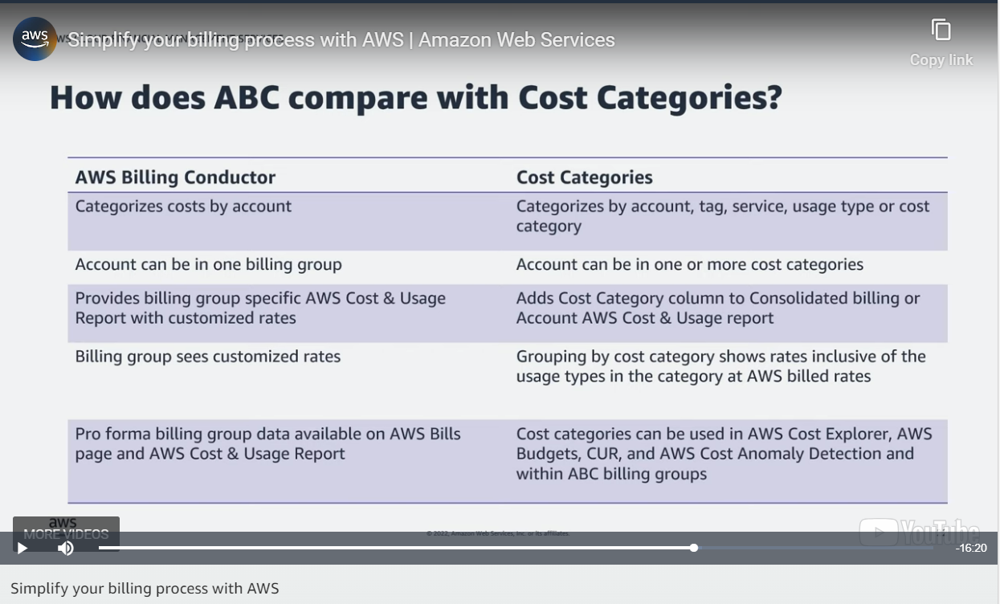
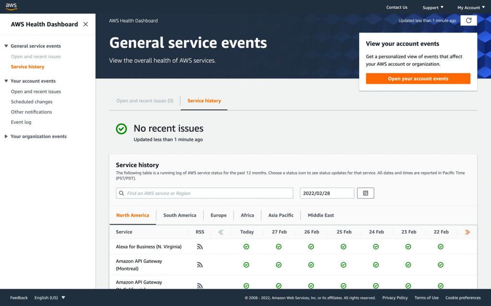

# Chapter 13 - Cost-Optimised Architectures

## AWS Free Tier

Consists of three types of offers:
* Always free: E.g., 1 million free invocations of AWS Lambda functions per month; 25 GB of free storage on Amazon DynamoDB per month
* Free for 12 months: E.g., some S3 Standard Storage; some EC2 compute time; some CloudFront outbound data transfer
* Trials: E.g., 90 days of Amazon Inspector

## AWS pricing concepts

* Pay for what you use
* Pay less when you reserve, e.g., with Savings Plans
* Pay less per unit when you use more

Examples:
* AWS Lambda charges you based on the number of requests made to your functions and how long the functions ran for.
* AWS ELB charges you based on how long your ELB has been used, how many connections it processed and how much data it transferred
* AWS S3 charges you based on how much data you store; what tier you store it at; how many requests you made to add, copy or retrieve your S3 objects; how much data you transferred into or out of S3; and what management features you enabled, e.g., object tagging

## Data transfer charges
* Inbound from Internet to AWS is free
* Outbound from AWS to internet is charged per service and per originating Region
* Transfer from your workload to AWS services could incur data transfer charges.
    * From your workload to the public endpoint of an AWS service within the *same* region is free when the data exits an internet gateway but charged per-GB if the data exits a NAT gateway.
    * From your workload to VPC gateway endpoints of S3 and DynamoDB are free
    * From your workload to VPC interface endpoints of other AWS services (e.g., AWS Backup, AWS Systems Manager, AWS CloudWatch Logs) are charged for
    * From VPC, Direct Connect or VPN to Transit Gateway is charged for
* Transfer within your workload:
    * Within an AZ is free
    * Cross-AZ is charged for
    * Cross-Region is charged per-GB, and the charge depends on the source and destination Region

## Billing dashboard

## Consolidated billing

Done through AWS Organizations. Apart from centrally viewing and paying bills, consolidated billing also lets you save money by:
* Sharing AWS Savings Plans across your accounts
* Qualifying for volume-based discounts based on aggreated usage across your accounts

## AWS Budgets

Send email alerts or SNS topic messages when your costs exceed or are forecast to exceed your budgeted amounts or, say, 80% of your budgeted amounts.

Types of budgets:
* Cost budgets
* Usage budgets
* RI utilisation or coverage budgets
* Savings Plans utilisation or coverage budgets

The information in AWS Budgets is updated three times a day, not in real-time.

## AWS Pricing Calculator

Free to use

Good for planning your AWS spend, finding cost saving opportunities and comparing AWS offerings

## Cost allocation tags

You can *activate* cost allocation tags in the Billing and Cost Management console so that AWS generates a cost allocation report (CSV file)

To *activate* cost allocation tags, go to the AWS Billing and Cost Management Console and click **Cost allocation tags**.

A tag has a key and value.

Some cost allocation tags are AWS-generated. It is identified by an "aws:" prefix in the key. For example:
* "aws:createdBy". If activated, AWS adds the tag to resources created in the future, where:
    * The "aws:createdBy" tag is available only in the Billing and Cost Management console and reports, and doesn't appear anywhere else in the AWS console, including the AWS Tag Editor.
    * The "aws:createdBy" tag does not count towards your tags per resource quota.
* "aws:awsApplication". AWS automatically adds it to all resources that are associated with applications that are set up in AWS Service Catalog AppRegistry

You can also define your own cost allocation tags

## Cost Categories

Free. Group your costs by account, tag, service and charge type.
Like AWS Billing Conductor, but even more powerful:

## AWS Billing Conductor (ABC)

Re-organise AWS' billing in a way that helps you to allocate costs to business units or product owners.

Costs money but saves the FinOps some effort. As the [Getting Started with AWS Billing Conductor](https://aws.amazon.com/blogs/aws-cloud-financial-management/getting-started-with-aws-billing-conductor/) blog post says, "With the launch of the AWS Billing Conductor (ABC), it’s easier than ever for FinOps teams to configure, generate, and share the right rates to the end users – irrespective of the rates the customer has negotiated with AWS. With ABC, customers can group end user accounts, apply custom pricing rules, add custom line items (e.g. shared support costs and other internal overhead costs), and generate CURs for each of end customers within 24 hours of setting up their ABC configuration."

## AWS Cost Explorer

Breaks down your costs by AWS service. Can further break it down by region, account and tag. Shows you the past 12 months of cost data.

Lets you create custom reports.

AWS Cost Explorer charges you based on the number of requests you make to it; and whether you want hourly granularity for the past 14 days of usage.

## AWS License Manager

Track and manage your software licenses from software vendors (for example, Microsoft, SAP, Oracle, and IBM) centrally across AWS and your on-premises environments.

Integrates with CloudWatch, where you can create alarms so that AWS will send SNS messages close to the expiry date of a license.

## AWS Marketplace

It's a place for you to find, test, buy and deploy third-party software to AWS. In some cases, you can even do one-click deployment. Usually they are pay-as-you-go offerings. Enterprises can even negotiate custom terms and pricing.

A private marketplace is even available.

AWS Marketplace can even integrate into your organisation's procurement systems through the Commerce XML (cXML) protocol.

You can buy software license entitlements from AWS Marketplace and then distribute, activate and track the software license entitlements through AWS License Manager.

If you buy an AMI from AWS Marketplace, you can use Cost Allocation Tags to identify and track the usage of the AMI, making it easier to allocate and report on costs.

AWS Marketplace provides a Vendor Insights feature to provide risk assessments about software vendors so that you can make responsible purchasing decisions.

## AWS Trusted Advisor

Evaluates your AWS account against five pillars: (COPSFTSL)
* Cost optimisation: E.g., buy AWS savings plans; turn off or vertically downscale EC2 instances; and vertically downscale EBS volumes
* Performance: E.g., High-throughput EBS volumes are attached to low-throughput EC2 instances
* Security: E.g., S3 buckets have open permissions; MFA not enabled for root user; security groups are too permissive; IAM access keys should be rotated
* Fault tolerance: E.g., EBS volumes without snapshots (backups), so you are at risk of data loss; EC2 instances are not balanced across AZs, RDS DB instances are launched in only one AZ
* Service limits: E.g., You have reached the limit of five VPCs per region

Some checks are free; others are only available if you have premium support plans.

AWS Trusted Advisor can send emails to your account's alternate contacts for billing, operations and security.

## AWS Health Dashboard

Shows status of AWS services by date

Shows AWS-caused service degradations or outages, grouped by either:
* The current account, e.g., an EC2 instance is affected by an AWS networking problem
* Your organisation

Lists planned lifecycle events, e.g., end of life of RDS for MySQL engine

See:

## AWS Health API

Like AWS Health Dashboard, but in an API form.

## AWS Launch Wizard

Declaratively deploy third-party applications like Microsoft SQL Server Always On or HANA-based SAP

You declare what performance you need, how many nodes you want, how much storage you want and what connectivity you want.

AWS Launch Wizard then gives you a quote, lets you modify your resources and can then deploy the resources. It also creates CloudFormation templates to make future deployments easier.

Free.

## AWS Resource Groups and Tag Editor

You can group related AWS resources into a *resource group*. For example, if your website consists of an EC2 instance, CloudFront distribution and an S3 bucket, you can group them into a resource group.

A resource group is defined by a query.

The query can be either tag-based or AWS CloudFormation stack-based. Some AWS services also implement resource  groups in their own way, e.g., Amazon EC2 capacity reservation pools and AWS Network Firewall rule groups.

To define a resource group, go to the AWS Management Console and click **Services > Management & Governance > Resource Groups & Tag Editor**.